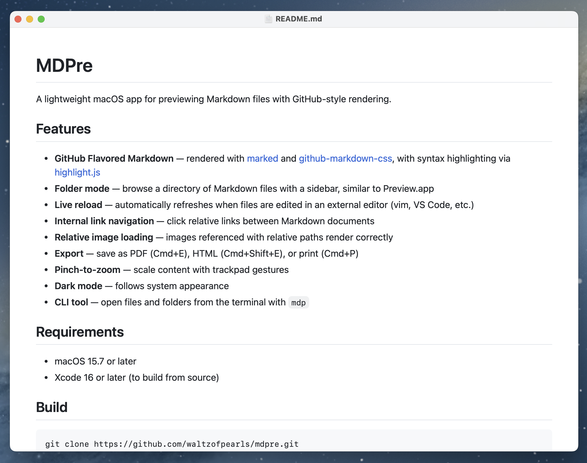
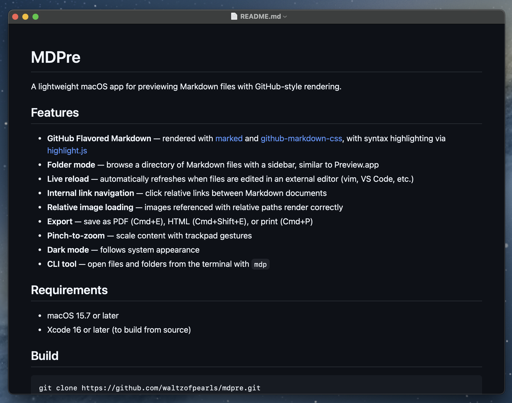

<p align="center">
  
</p>

# MDPre

A lightweight macOS app for previewing Markdown files with GitHub-style rendering.

<p>
  
  
</p>

## Features

- **GitHub Flavored Markdown** — rendered with [marked](https://github.com/markedjs/marked) and [github-markdown-css](https://github.com/sindresorhus/github-markdown-css), with syntax highlighting via [highlight.js](https://highlightjs.org/)
- **Folder mode** — browse a directory of Markdown files with a sidebar, similar to Preview.app
- **Live reload** — automatically refreshes when files are edited in an external editor (vim, VS Code, etc.)
- **Internal link navigation** — click relative links between Markdown documents
- **Relative image loading** — images referenced with relative paths render correctly
- **Export** — save as PDF (Cmd+E), HTML (Cmd+Shift+E), or print (Cmd+P)
- **Pinch-to-zoom** — scale content with trackpad gestures
- **Dark mode** — follows system appearance
- **CLI tool** — open files and folders from the terminal with `mdp`

## Requirements

- macOS 15.7 or later
- Xcode 16 or later (to build from source)

## Build

```sh
git clone https://github.com/waltzofpearls/mdpre.git
cd mdpre
open MDPre.xcodeproj
```

Then build and run in Xcode (Cmd+R).

## CLI Tool

MDPre bundles a command-line tool called `mdp`.

### Usage

```sh
mdp README.md          # preview a single file
mdp ./docs/            # preview a folder with sidebar
mdp file1.md file2.md  # open multiple files
```

### Installing

From the app menu: **Markdown Preview > Install Command Line Tool...**

Or manually create a symlink:

```sh
sudo ln -sf /Applications/Markdown\ Preview.app/Contents/MacOS/mdp /usr/local/bin/mdp
```

## License

[MIT](LICENSE)
