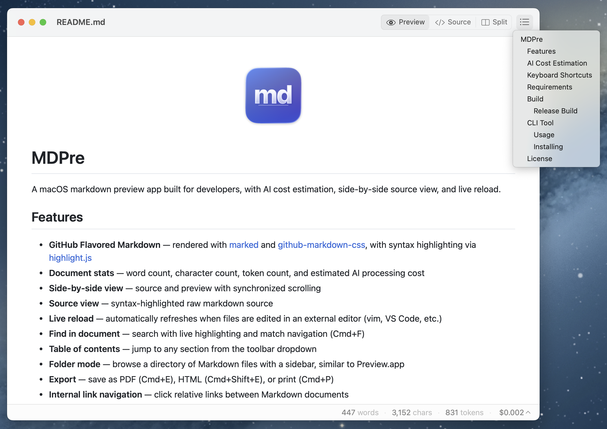
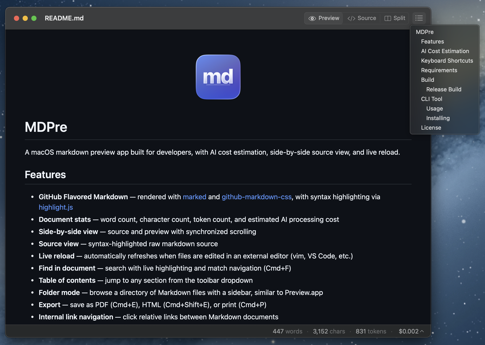
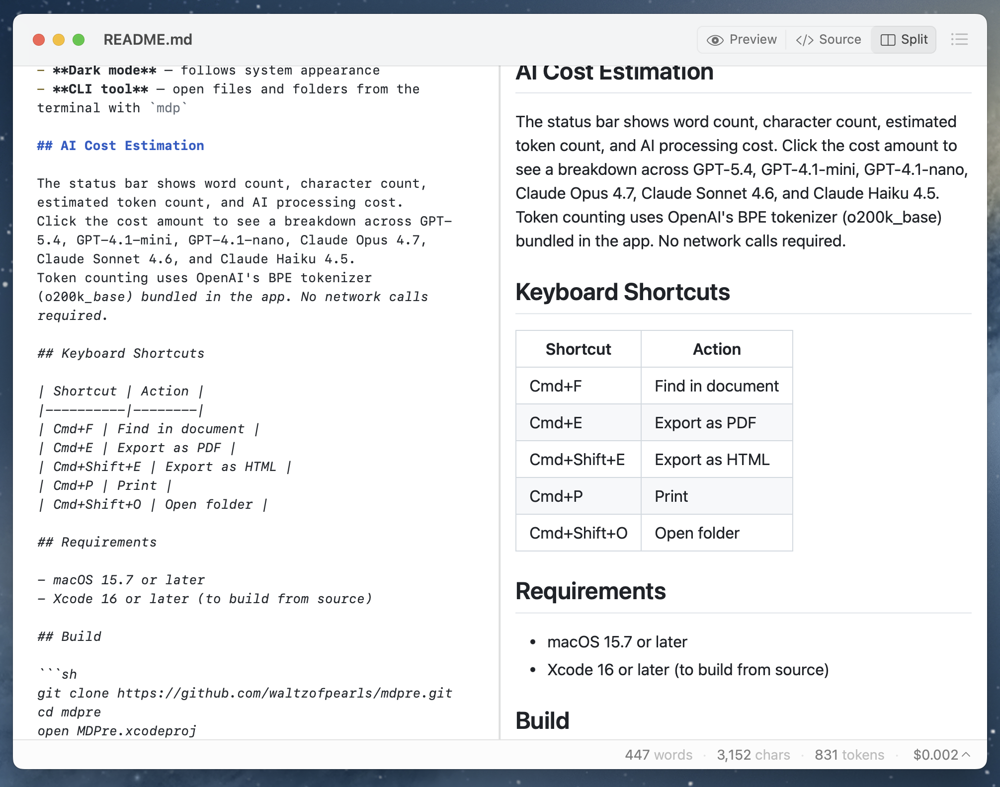
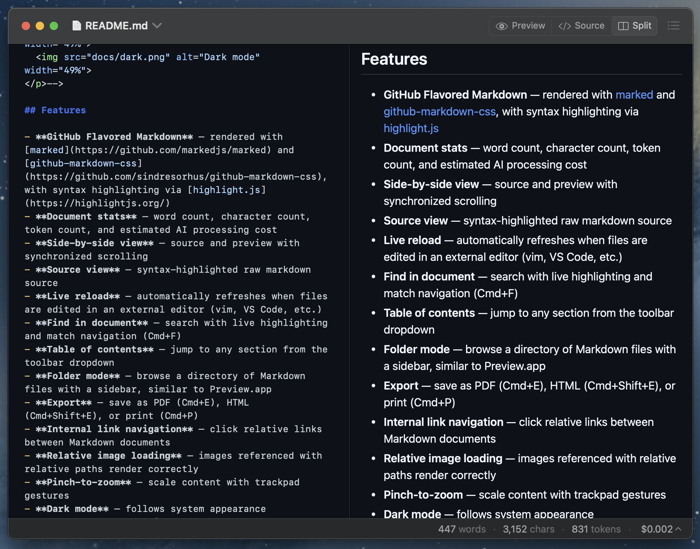
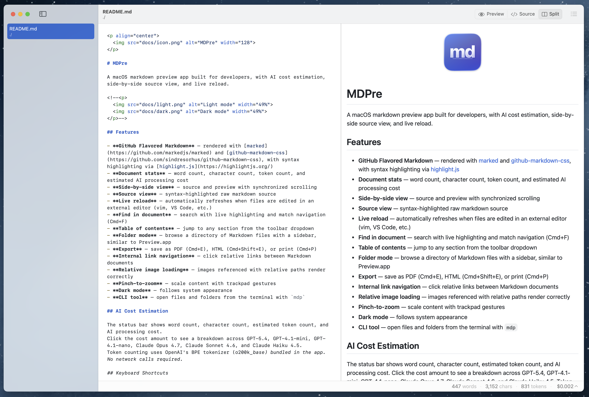
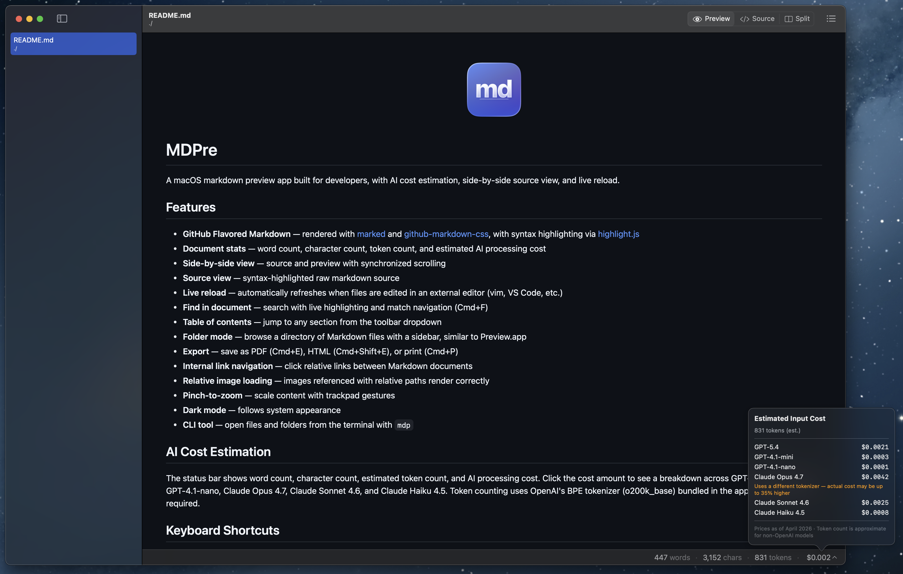

<p align="center">
  
</p>

# MDPre

A macOS markdown preview app built for developers, with AI cost estimation, side-by-side source view, and live reload.

**Single-file preview**

<p>
  
  
</p>

**Side-by-side source and preview**

<p>
  
  
</p>

**Folder mode with sidebar**

<p>
  
  
</p>

## Features

- **GitHub Flavored Markdown** rendered with [marked](https://github.com/markedjs/marked) and [github-markdown-css](https://github.com/sindresorhus/github-markdown-css), with syntax highlighting via [highlight.js](https://highlightjs.org/)
- **Document stats** showing word count, character count, token count, and estimated AI processing cost
- **Side-by-side view** with source and preview, synchronized scrolling
- **Source view** with syntax-highlighted raw markdown
- **Live reload** that automatically refreshes when files are edited in an external editor (vim, VS Code, etc.)
- **Find in document** with live highlighting and match navigation (Cmd+F)
- **Table of contents** to jump to any section from the toolbar dropdown
- **Folder mode** to browse a directory of Markdown files with a sidebar, similar to Preview.app
- **Export** as PDF (Cmd+E), HTML (Cmd+Shift+E), or print (Cmd+P)
- **Internal link navigation** between Markdown documents via relative links
- **Relative image loading** for images referenced with relative paths
- **Pinch-to-zoom** to scale content with trackpad gestures
- **Auto-update** via Sparkle for automatic update checking and installation
- **Dark mode** following system appearance
- **CLI tool** to open files and folders from the terminal with `mdp`

## AI Cost Estimation

The status bar shows word count, character count, estimated token count, and AI processing cost.
Click the cost amount to see a breakdown across GPT-5.4, GPT-4.1-mini, GPT-4.1-nano, Claude Opus 4.7, Claude Sonnet 4.6, and Claude Haiku 4.5.
Token counting uses OpenAI's BPE tokenizer (o200k_base) bundled in the app. No network calls required.

## Keyboard Shortcuts

| Shortcut | Action |
|----------|--------|
| Cmd+F | Find in document |
| Cmd+E | Export as PDF |
| Cmd+Shift+E | Export as HTML |
| Cmd+P | Print |
| Cmd+Shift+O | Open folder |

## Install

Download the latest DMG from [GitHub Releases](https://github.com/waltzofpearls/mdpre/releases), open it, and drag Markdown Preview to your Applications folder.

The app checks for updates automatically via Sparkle. You can also check manually from **Markdown Preview > Check for Updates...**

## Requirements

- macOS 15.7 or later
- Xcode 16 or later (to build from source)

## Build

```sh
git clone https://github.com/waltzofpearls/mdpre.git
cd mdpre
open MDPre.xcodeproj
```

Then build and run in Xcode (Cmd+R).

### Release Build

To build a signed and notarized DMG for distribution:

```sh
APPLE_PASSWORD=your-app-specific-password make build
```

This runs: xcodebuild, gon sign, create-dmg, gon notarize. See the [Makefile](Makefile) for details.

## CLI Tool

Markdown Preview bundles a command-line tool called `mdp`.

### Usage

```sh
mdp README.md          # preview a single file
mdp ./docs/            # preview a folder with sidebar
mdp file1.md file2.md  # open multiple files
mdp --help             # show usage
```

### Installing

From the app menu: **Markdown Preview > Install Command Line Tool...**

Or manually create a symlink:

```sh
sudo ln -sf /Applications/Markdown\ Preview.app/Contents/MacOS/mdp /usr/local/bin/mdp
```

## License

[Apache 2.0](LICENSE)
