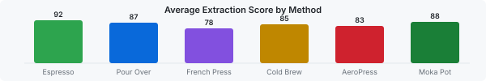

# Brew Lab

A CLI tool for managing your coffee brewing recipes.



## Quick Start

Install with Homebrew, then start brewing:

```sh
brew install brewlab
brewlab brew --recipe espresso
```

## Supported Methods

| | Espresso | Pour Over | French Press | Cold Brew | AeroPress | Moka Pot |
|---|---|---|---|---|---|---|
| **Time** | 25s | 3min | 4min | 12hr | 2min | 5min |
| **Ratio** | 1:2 | 1:15 | 1:12 | 1:8 | 1:6 | 1:10 |

## Features

- Track grind size, water temp, and extraction time
- Rate and compare your brews
- Export recipes to share with friends
- Works offline, data stays on your device

## Dialing In

Grind size is the biggest lever on extraction. Change one variable at a time,
then taste before adjusting anything else.

If the cup tastes **sour**, the extraction was too short. Grind finer.
If it tastes **bitter**, the extraction ran long. Grind coarser.

```sh
brewlab dial --method pour-over --step finer
brewlab log --rating 8 --notes "brighter, less muddy"
```

## Recipes

Recipes live in `~/.brewlab/recipes` as plain files. Copy one and edit it.

1. Start from the closest built in recipe
2. Adjust dose and yield, keeping the ratio fixed
3. Log three brews before deciding it is better

> Consistency beats precision. A repeatable average brew teaches you more
> than one great cup you cannot reproduce.

## Roadmap

- [x] Extraction scoring across all six methods
- [x] Offline mode, no account required
- [ ] Scale integration over Bluetooth
- [ ] Shared recipe library
